# iOS Calculator

## 1 项目需求

该项目是同济大学软件学院2020年移动应用开发的第二次课程作业。

使用UIKit和SwiftUI分别开发一个计算器应用程序。具体要求如下：

### 1.1 使用UIKit开发计算器

1.   使用MVC架构进行计算器开发，代码中需要包括Module、View、Controller的部分
2.   使用AutoLayout，使得计算器能够在不同的iPhone和iPad上正常显示
3.   计算器不需要支持多步计算（优先级等）

### 1.2 使用SwiftUI开发计算器

1. 使用MVVM架构进行计算器开发
2. 计算器能够在不同的iPhone和iPad上正常显示
3. 计算器不需要支持多步计算（优先级等）


## 2  项目设计

### 2.1 开发环境

Xcode 12.0.1 + Swift 5.0

### 2.2 核心代码(UIKit开发)

#### 2.2.1 文件目录

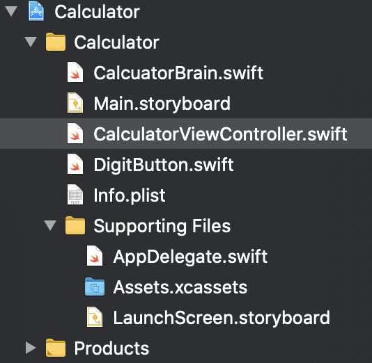

采用MVC架构，Main.storyboard为View部分，CalculatorViewController.swift为Controller，CalculatorBrain为Model。DigitButton.swift中将所有Button设置为圆角，外观更符合iOS原生计算器。

#### 2.2.2 View

View由三部分组成：

- 黄色矩形框中为**DisplayValueOutlet**，显示计算结果；
- 红色矩形框中为运算符Button，与之相关联的为**performOperation**方法；
- 蓝色矩形框中为数字Button，与之相关联的为**touchDigit**方法。

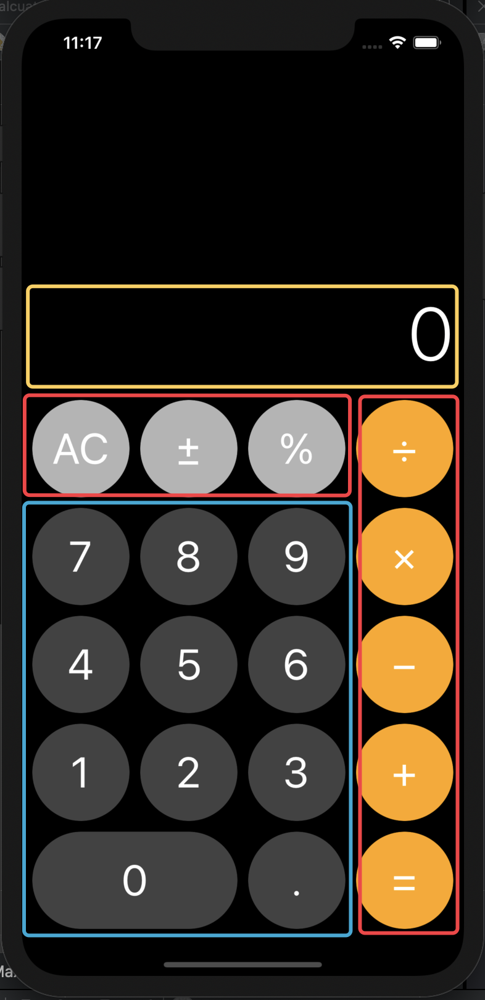

使用**AutoLayout**使之在多设备可以正常显示：

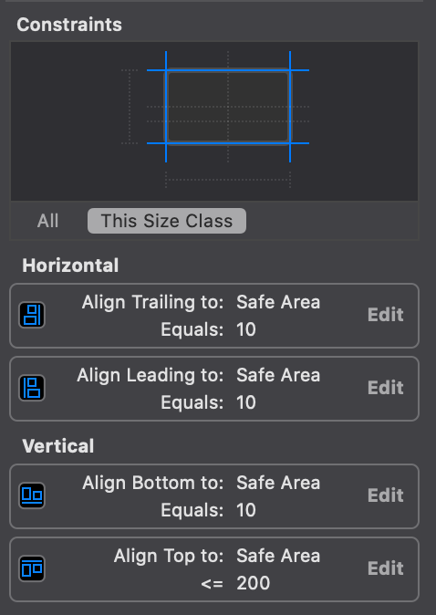

#### 2.2.3 Controller

设置变量displayValue来更改Outlet的显示：

```swift
    @IBOutlet weak var displayVlaueOutlet: UILabel!
    var displayValue: Double {
        get {
            return Double(displayVlaueOutlet.text!)!
        }
        set {
            if Double(Int(newValue)) == newValue {
                displayVlaueOutlet.text = String(Int(newValue))
            }else {
                displayVlaueOutlet.text = String(newValue)
            }
        }
    }
```

对于数字键输入进行判断，如果**userIsInTyping**为真，说明用户正在输入数字的过程中，所以对数字进行处理，由于类型均为**String**，所以可以直接相加；如果**userIsInTyping**为假，则说明用户输入的是**”.“**或者首位数字，进行设置**userIsInTyping**为真。

```swift
    @IBAction func touchDigit(_ sender: UIButton) {
        let digit = sender.currentTitle!
        let textCurrentInDisplay = displayVlaueOutlet.text!
        // 如果正在输入中
        if userIsInTyping {
            if digit == "0" && textCurrentInDisplay == "0" {
                displayVlaueOutlet.text = "0"
            }
            else {
                displayVlaueOutlet.text = textCurrentInDisplay + digit
            }
        }
        else {
            if digit == "." {
                displayVlaueOutlet.text = "0."
            }else {
                displayVlaueOutlet.text = digit
            }
            userIsInTyping = true
        }
    }
```

对于操作符按键进行处理，调用**Model**中相关方法处理运算。

```swift
    @IBAction func performOperation(_ sender: UIButton) {
        // 1. 设置操作数
        if userIsInTyping {
            brain.setOperand(displayValue)
            // 设置完操作符之后，需要接受第二个操作数
            userIsInTyping = false
        }
        // 2.执行计算
        brain.performOperation(sender.currentTitle!)
        
        // 3.获取结果
        if let result = brain.result {
            displayValue = result
        }
    }
```


#### 2.2.4 Model

Model中定义操作的类型：

```swift
private enum Operation {
        // 常量操作
        case constant(Double)
        // 一元操作
        case unary((Double) -> Double)
        // 二元操作
        case binary((Double,Double) -> Double)
        // ..equal
        case equal
    }
```

定义操作符对应的运算：

```swift
    private var operations: [String: Operation] = [
        "AC":   .constant(0),   // 清空，直接返回0
        "±" :   .unary({-$0}),
        "%" :   .unary({$0 / 100}),
        "+" :   .binary( + ),
        "−" :   .binary( - ),
        "×" :   .binary( * ),
        "÷" :   .binary( / ),
        "=" :   .equal,
    ]
```

设置操作数：

```swift
    mutating func setOperand(_ operand: Double) {
        self.operand = operand
        result = operand
    }
```

等待中的操作数和操作符：

```swift
    private struct PendingBinaryOperation {
        let firstOperand: Double
        let operation: (Double, Double) -> Double
        func perform(with secondOperand: Double) -> Double {
            return operation(firstOperand,secondOperand)
        }
    }
```

执行计算：

```swift
 mutating func performOperation(_ symbol: String) {
        
        let operation = operations[symbol]!
        
        switch operation {
        case .constant(let value):
            result = value
            pendingOperation = nil
        case .unary(let function):
            if operand != nil {
                result = function(operand!)
            }
        case .binary(let function):
            if operand != nil {
                pendingOperation = PendingBinaryOperation(firstOperand: operand!, operation: function)
                result = nil
            }
        case .equal:
            if pendingOperation != nil && operand != nil {
                result = pendingOperation?.perform(with: operand!)
            }
        }
```


### 2.3 核心代码(SwiftUI开发)

#### 2.3.1 目录文件

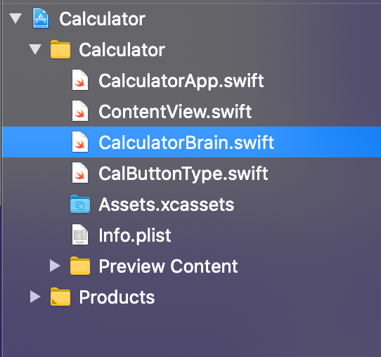

#### 2.3.2 ContentView

通过VStack和HStack构建基本的图形：

```swift
var body: some View {
            VStack(spacing : 20) {
                Text(self.data.text)
                    .frame(maxWidth:.infinity,maxHeight:200,alignment: .trailing)
                    .padding(.trailing,50)
                    .font(.system(size: 60))
                    .foregroundColor(Color("result_fg"))
                    .opacity(self.data.opacity)
                
                ForEach(0..<calculatorNumber.count) { i in
                    HStack {
                        ForEach(0..<calculatorNumber[i].count ) { j in
                            CustomButton(calculatorNumber[i][j],self.$data)
                        }
                    }
                }
            }
            .frame(maxWidth: .infinity,maxHeight: .infinity)
            .background(Color("Color_bg"))
            .edgesIgnoringSafeArea(.all)
    }
```

#### 2.3.3 CalculatorBrain

进行计算器的运算，对于运算符、数字、特殊符号以及小数的处理

#### 2.3.4 CulButtonType

定义了三种不同类型的按钮：

```swift
enum CalButtonType {
    case number(_ text:String)
    case calOperator(_ text:String)
    case calSOperator(_ text:String)
   }
```

并对他们的颜色、处理方式进行设置。

```swift
prefix operator %
prefix operator -
prefix operator +

prefix func %(right: String) -> CalButtonType {
    return .calSOperator(right)
}

prefix func -(right: String) -> CalButtonType {
    return .calOperator(right)
}

prefix func +(right: String) -> CalButtonType {
    return .number(right)
}

let calculatorNumber:[[CalButtonType]] = [[%"AC",%"±",%"％",-"÷"],
                                          [+"7",+"8",+"9",-"×"],
                                          [+"4",+"5",+"6",-"-"],
                                          [+"1",+"2",+"3",-"+"],
                                          [+"0",+".",-"="],]
```


## 3 测试

### 3.1 UIkit+MVC版本

 iphone 11 Pro Max

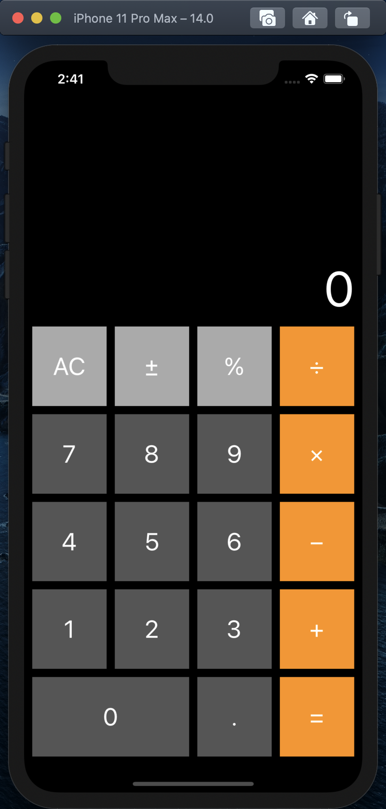

旋转适配：

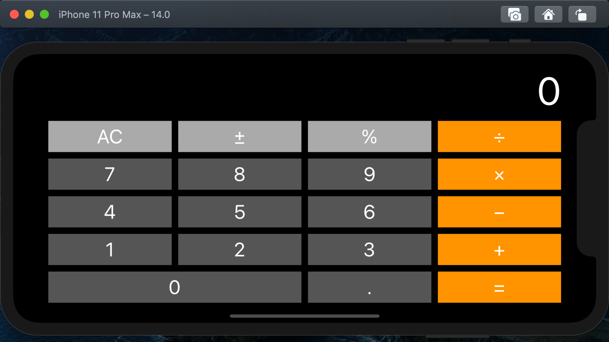

适配各种屏幕大小的iphone（与iphone8 plus对比）：

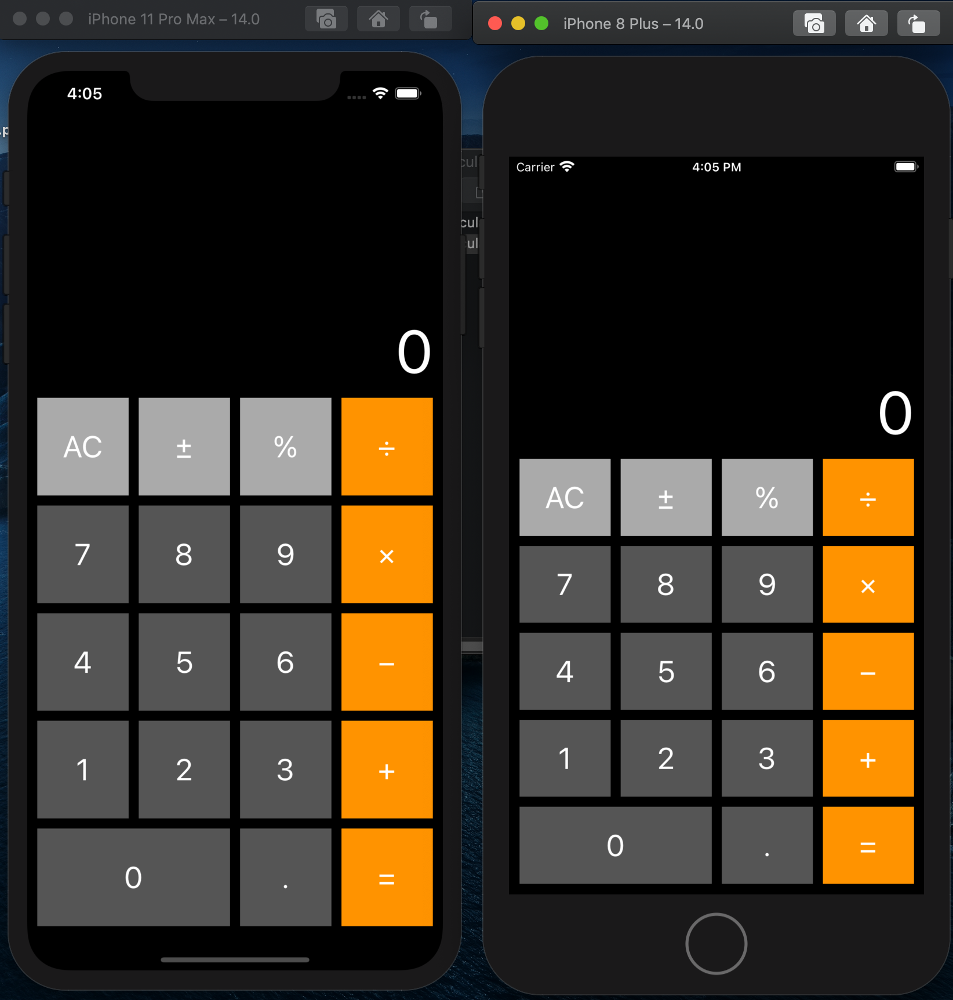

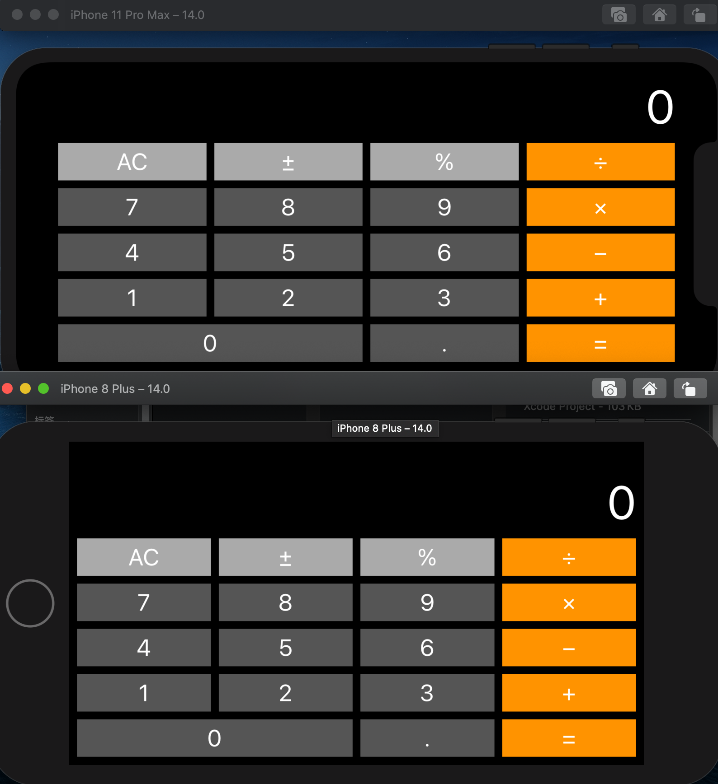

适配iPad：

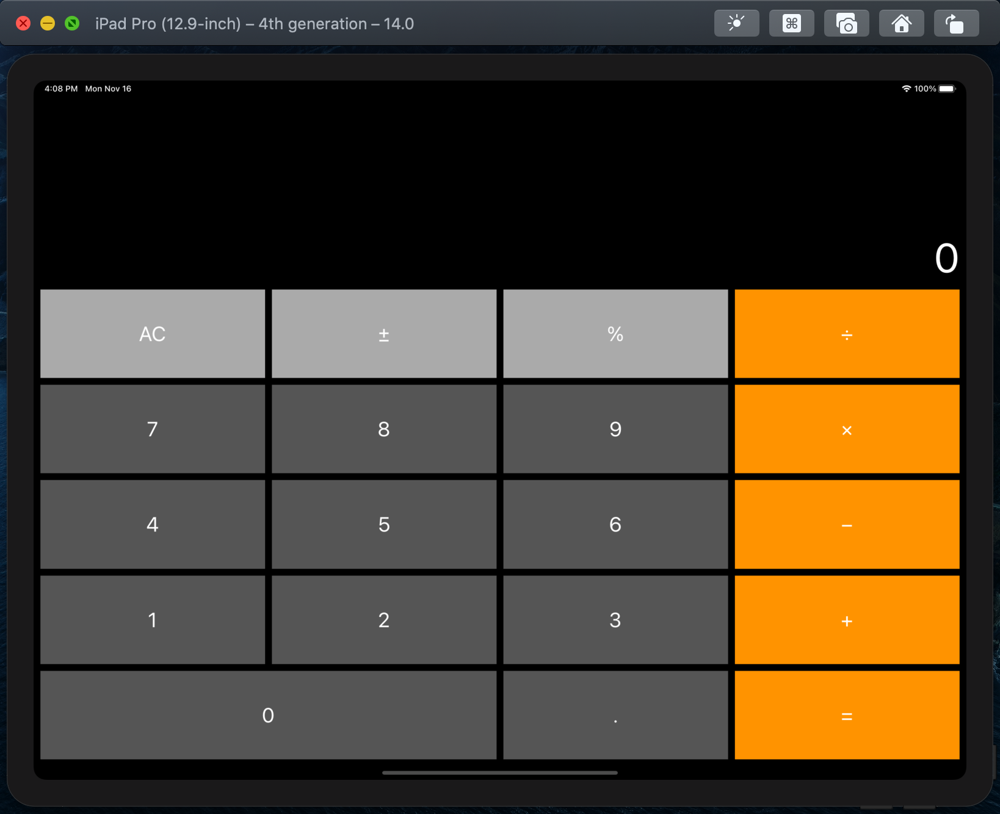

ipad旋转：

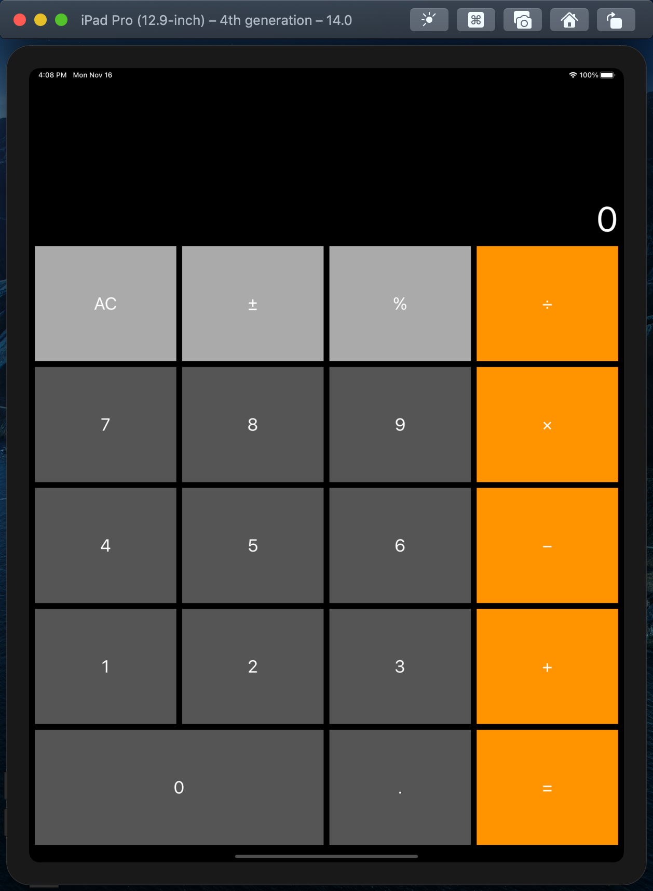

### 3.2 SwiftUI+MVVM版本

iphone 11 Pro Max

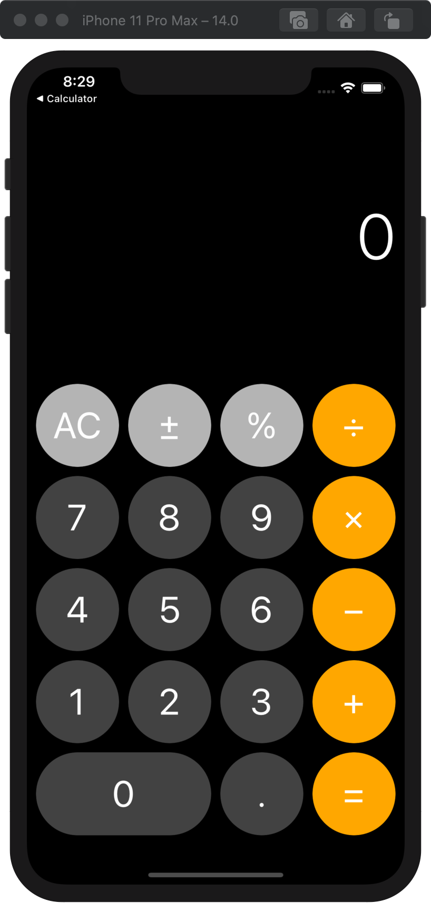

上图还原度还比较高，比较美观，但是要适配横屏以及各尺寸ipad，不得不进行一些修改：将图标设置为圆形，会影响横屏的效果，所以在后续测试取消了圆形。

横屏：

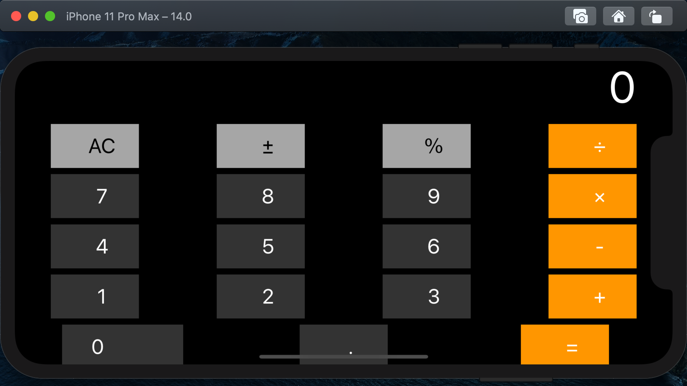

大尺寸iPad Pro：

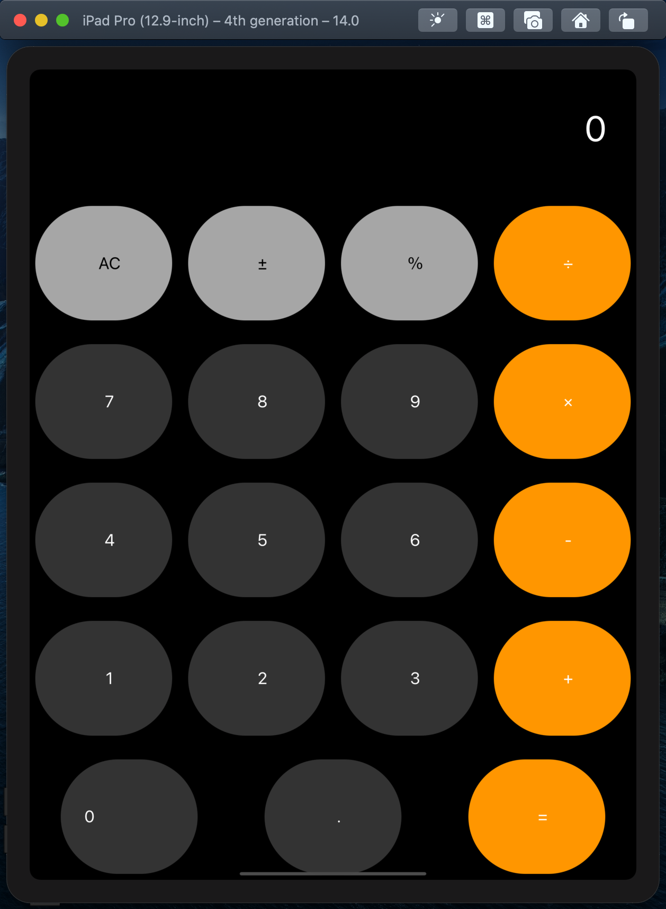


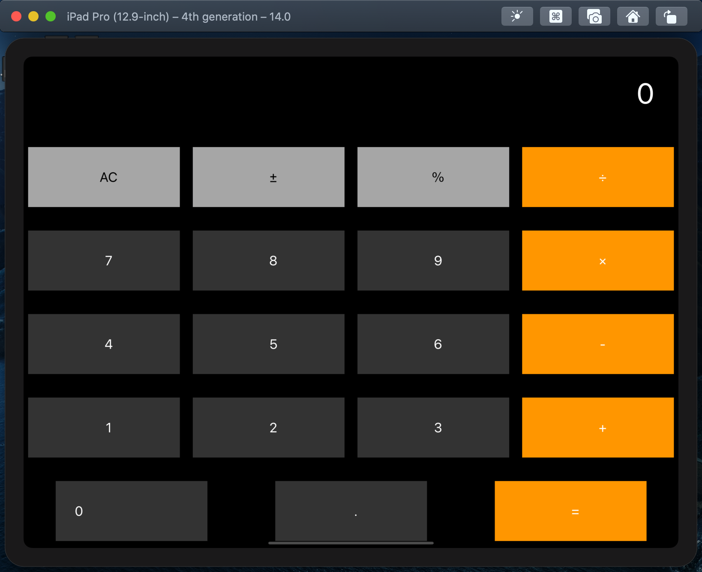


### 3.3 功能测试

可以进行加减乘除的连续运算，可以清零，取相反数，百分号运算，可以进行小数运算。

加法：


减法：


乘法：


除法：


小数：


特殊符号：


